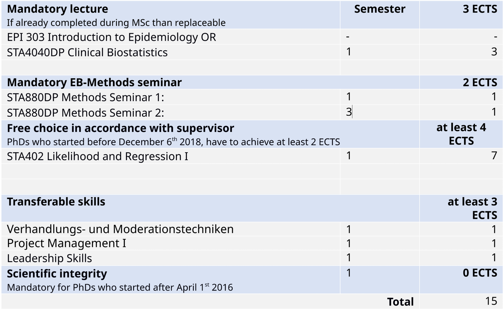
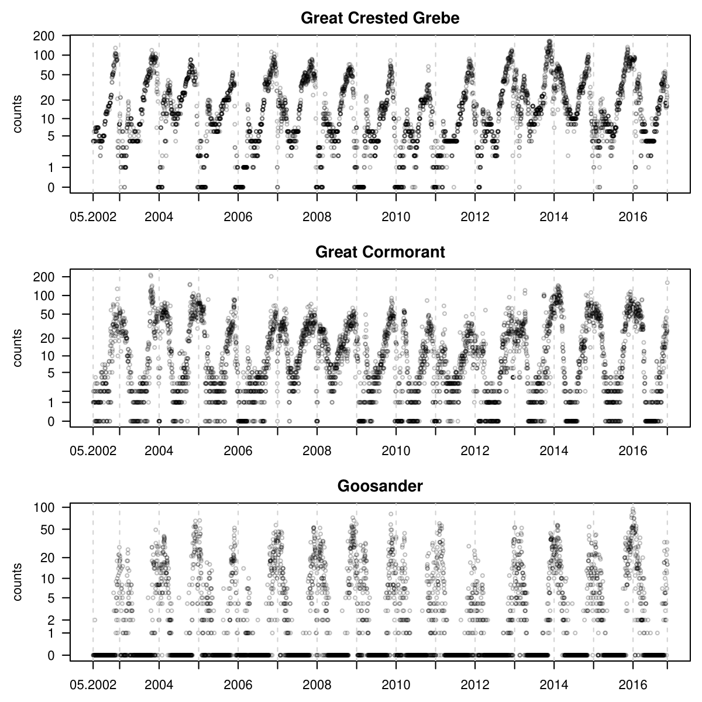
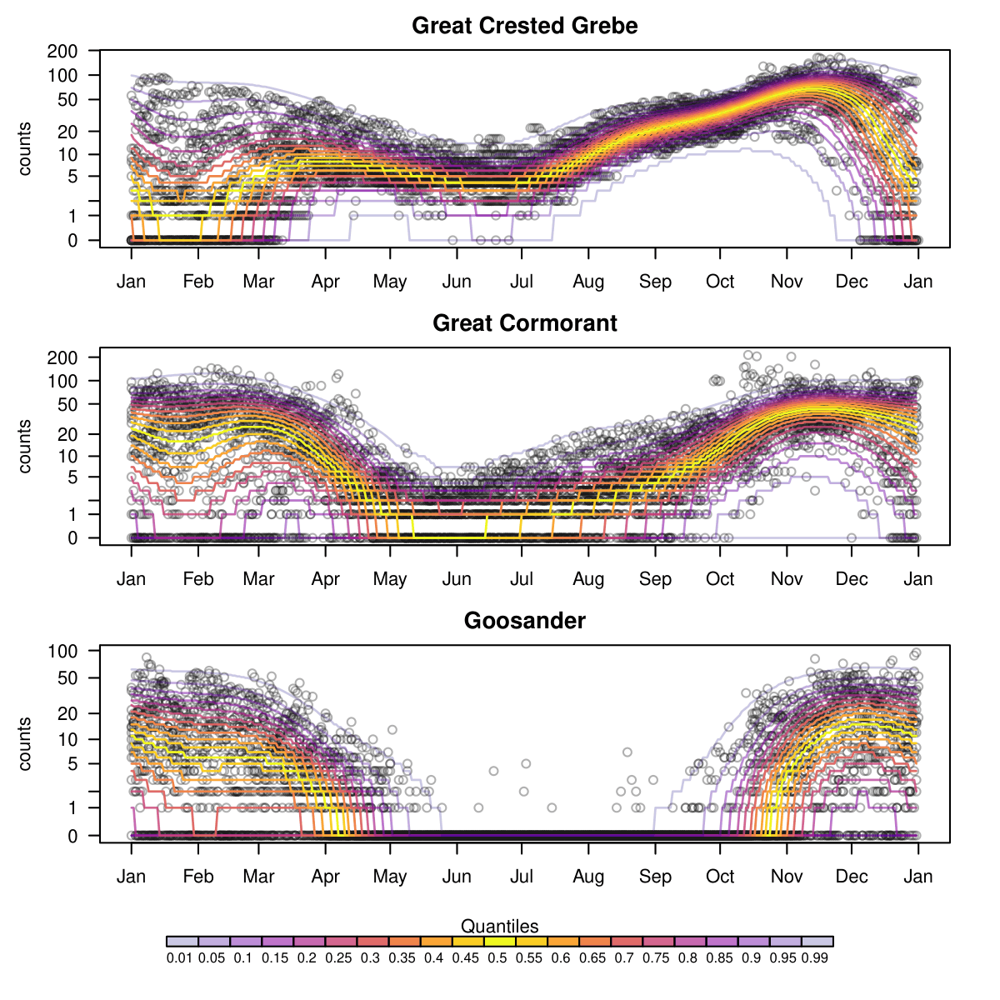
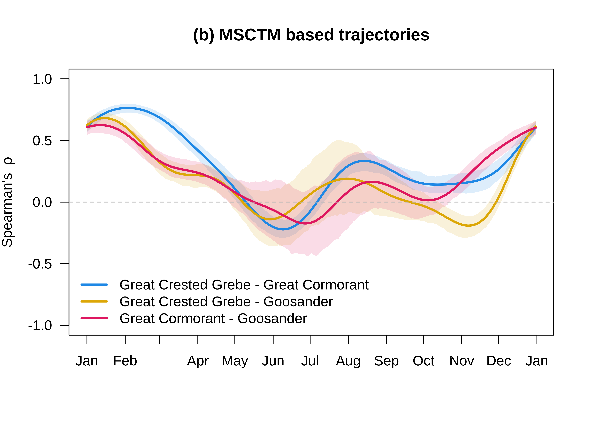

## Planned Teaching (100-420h)

- [x] Semester 2 / 50h -- STA425 Survival Analysis
- [ ] Semester 3 / 80h -- STA402 Likelihood and Regression

## Planned Course Work  (min 12 ECTS)

MANDATORY:

- [x] 3 ECTS -- STA4040DP Clinical Biostatistics
- [x] 1 ECTS -- STA880DP Methods Seminar 1
- [ ] 1 ECTS -- STA880DP Methods Seminar 2
- [x] 0 ECTS -- Scientific Integrity

FREE CHOICE: (min 4 ECTS)

- [x] 7 ECTS -- STA402 Likelihood and Regression I

TRANSFERABLE SKILLS: (min 3 ECTS)

- [x] 1 ECTS -- Verhandlungs- und Moderationstechniken
- [x] 1 ECTS -- Project Management I
- [x] 1 ECTS -- Leadership Skills

## Defense

Around April 2028

One more committee meeting in 2027 😃

# Statistics

1. Wishlist
2. Motivating Birds
3. Theoretical Framework
4. Counts
5. Structural Equation Models (SEM)

## Statisticians' Wishlist {.incremental}

<!-- MATH Macros -->
::: {.content-hidden}  
$$
  
$$
:::

::: {.incremental}

1. Distribution-free regression models
2. Multivariate via Gaussian copula $\mSigma$
    - Counts
    - Regression parameters $A_{ij}$ from $\mSigma$
3. Covariate-dependent Gaussian copula: $\mSigma(\xvec)$
    - $A(\xvec)_{ij}$ from $\mSigma(\xvec)$

:::

---

Count Time Series

---

$F_{Y_j \mid \xvec}(y_j) = \Phi_{0,1}(h_j(y_j\mid \xvec)),\quad$ for $j=1,2,3$

---

$\mSigma(\xvec)_{ij},\quad$ for each pair $(i,j)$

## Theoretical Framework

**Univariate model:**

$$F_{Y_j}(y_j) = \Phi_{0,1} (h_j(y_j)),$$

where $h_j$ is a monotonic transformation function.

- step function
- smooth function (via Bernstein spline basis)

. . . 

**Multivariate model:**

$$F_{\mY}(\yvec) = {\Phi}_{\nullvec,\mSigma}(\hvec(\yvec))$$

<!-- - j is any index in $\{1,\dots,J\}$ -->
- $\mY = (Y_1,\dots,Y_J)^\top$
- $\hvec(\mY) = (h_1(Y_1), \dots, h_J(Y_J))^\top$
<!-- - $\yvec = (y_1, \dots, y_J)^\top$ realization of $\mY$ -->

## Covariance Structure

- $\diag(\mSigma) \overset{!}{=} \onevec$

- $\mSigma := \mOmega^{-1} \mOmega^{-\top}$ 

- $\mOmega := \mLambda\diag(\mLambda^{-1}\mLambda^{-\top})^{\frac{1}{2}}$

- $\mLambda :=
        \begin{pmatrix}
          1 & & &  0 \\
          \lambda_{21} & 1  & & \\
          \vdots &  \ddots & \ddots & \\
          \lambda_{J1}  & \dots & \lambda_{J,J-1} & 1
        \end{pmatrix}$
<!-- - $\mLambda$ is a lower triangular matrix with $\diag(\mLambda)=\onevec$ -->

## Regressions 

- $\hvec(\mY) \sim \ND(\nullvec, \mSigma) = \ND(\nullvec, \mOmega^{-1} \mOmega^{-\top})$
- $\mOmega \,\hvec(\mY) \sim \ND(\nullvec, \mI)$

. . . 

The $i$-th row of $\mOmega \, \hvec(\mY)$:

$$
  % F(h_j(Y_j)\mid \mY_{<j})
  % = 
  \sum_{i=1}^{j}\Omega_{ji}h_i(Y_i) \sim \ND(0, 1) 
$$

. . . 

$$
  h_j(Y_j) - \sum_{i=1}^{j-1}\underbrace{-\frac{\Omega_{ji}}{\Omega_{jj}}}_{A_{ij}:=}h_i(Y_i) \sim \ND(0, \Omega_{jj}^{-2})
$$

. . . 

$$
h_j(Y_j) = A_{1j} h_1(Y_1) + \dots + A_{j-1,j} h_{j-1}(Y_{j-1}) + \varepsilon_j, \quad \varepsilon_j \sim \ND(0, \Omega_{jj}^{-2}) 
$$

## Covariates $\xvec$

- $F_{\mY\mid \xvec}(\yvec) = {\Phi}_{\nullvec,\mSigma(\xvec)}(\hvec(\yvec \mid \xvec))$
- $\hvec(\mY \mid \xvec) = (h_1(Y_1 \mid \xvec), \dots, h_J(Y_J \mid \xvec))^\top$
  - Linear shift: $\hvec(\mY \mid \xvec) = \hvec(\mY) - (\betavec_1, \dots, \betavec_J)^\top\xvec$
    - Marginally:  $h_j(y_j \mid \xvec) = h_j(y_j) - {\betavec_j}^\top\xvec$
    - Add scaling: $\h_j(\ry_j | \rx)= \mathrm e^{\gammavec_j(\rx)} \h_j(\ry_j) - {\betavec_j}^\top\xvec$

<!-- 
## Sampling:

- $\mU \sim \UD([0,1]^J)$
- and compute $\mY = F_{\mY\mid\xvec}^{-1}(\mU) =  h^{-1}(\Phi_{\nullvec,\Sigma(x)}^{-1}(U) + (\betavec_1, \dots, \betavec_J)^\top \xvec)$
-  or dimensionwise $Y_j = {F_{\mY\mid\xvec}^{-1}(\mU)}_j = h_j^{-1}({\Phi_{\nullvec,\Sigma(x)}^{-1}(\mU)}_j + \betavec_j^\top \xvec)$
 -->

## Counts 

- Define $\mC = (C_1, \dots, C_J) := (\lceil Y_1 \rceil, \dots, \lceil Y_J \rceil) = \lceil \mY \rceil$

. . . 

- $F_{\mC}(\cvec) = F_{\mY}(\cvec)\quad$ for $\cvec \in {\NN_0}^J$

. . . 

- $F_{\mC}(\yvec) = F_{\mY}(\lfloor \yvec \rfloor)\quad$ for $\yvec \in \RR^J$

. . . 

Then for $\cvec \in {\NN_0}^J$:

$$
  \begin{aligned}
  \Prob(\mC = \cvec) 
  % &= F_{\mC}(\cvec) + (-1)^1 \sum_{j=1}^J F_{\mC}(\cvec - \evec_j) + \dots + (-1)^J F_{\mC}(\cvec - \sum_{j=1}^J \evec_j)\\
  % &= F_{\mY}(\cvec) + (-1)^1 \sum_{j=1}^J F_{\mY}(\cvec - \evec_j) + \dots + (-1)^J F_{\mY}(\cvec - \sum_{j=1}^J \evec_j)\\
  % &= \Prob\!\left(\mY \in \prod_{j=1}^J (c_j - 1, c_j]\right)
  &= \Prob\!\left(\mY \in (\cvec - \onevec, \cvec]\right)\\
  &= \int_{\cvec - \onevec}^{\cvec} f_{\mY\mid \xvec}(\yvec) \mathrm{d}\yvec = \int_{\hvec(\cvec - \onevec \mid \xvec)}^{\hvec(\cvec \mid \xvec)} \phivec_{\mSigma(\xvec)}(\zvec) \mathrm{d}\zvec
  \end{aligned}
$$
<!-- , where $\evec_j$ is the j-th unit vector in $\RR^J$. -->
<!-- - approximated via Genz XXX & Hothorn XXX -->

. . . 

**Publication 1:** Multi-Species Counts Transformation Models 

<!-- 
## Birds
- $\mC \in {\NN_0}^3$ encodes the counts of 3 bird species. 
- Time Series of daily counts over 11 years
- $\xvec$ encodes the day-of-year via Fourier basis
- assume: $C_i \perp C_j \mid \xvec$

. . . 

**Goal:**

- marginal $F_{C_j|\xvec}(y)$
- $\mSigma(\xvec)$
-->

## Structural Equation Models (SEM)

:::: {.columns}

::: {.column width="60%"}
](_assets/LISREL-graph.png)
:::

::: {.column width="40%"}
- Latent variables $\rightarrow$ indicators
- Regression between latent variables
- Path analysis (e.g., mediation)
- Explain $\mSigma_{\mathrm{total}}$ using $\mSigma_{\mathrm{model}}$
:::

::::

## SEM: Core Objectives

## Ordinal Variables [@muthenGeneralStructuralEquation1984]

Modeled via Gaussian latent variables and threshold transformations:

## LISREL Framework

](_assets/LISREL-table.png)

## Reticular Action Model (RAM) 
<!-- [@bokerReticularActionModel2018] -->

[@mcardleAlgebraicPropertiesReticular1984]

$$
  \mSigma = (\mI - \mA)^{-1} \mS (\mI - \mA)^{-\top}
$$

- $\mA$: Directed effects / regression coefficients
- $\mS$: Covariances of error terms

**Limitations:**

- Unidentifiable
- Lacks flexible transformations

---

### Multivariate Transformation Models (MTMs)
<!-- Different constraints std.lv TRUE -->
Assume causal ordering
$$\mY = (\mY_{\text{latent}}, \mY_{\text{observed}})^\top$$

Expressed in RAM notation:

- $\mA = \mI-\diag(\mOmega)^{-1}\mOmega$
- $\mS = \diag(\mOmega)^{-2}$

$$
\mSigma = (\mI - \mA)^{-1}\mS(\mI - \mA)^{-\top} 
% = (\diag(\mOmega)^{-1}\mOmega)^{-1}\diag(\mOmega)^{-2}(\diag(\mOmega)^{-1}\mOmega)^{-\top} 
= \mOmega^{-1} \mOmega^{-\top}
$$

## Publication 2: _SEMs via MTMs_

**Key Advantages:**

- Simple, identifiable parameterization
- Flexible marginal transformations
- Joint estimation of transformations and regression parameters

---

### Current Progress & Tasks 

- [x] Parameterization mapping to LISREL and RAM
- [x] Consistent results for common examples
- [x] Transformations:
    - Ordinal
    - Continuous (via Bernstein basis polynomials)

- [ ] Review SEM literature
- [ ] Formalize theoretical write-up
- [ ] Initiate collaboration with SEM experts (e.g., Prof. Yves Rosseel)
- [ ] Simulation Study:
    - Evaluate standard errors
    - Assess the effect of joint estimation on transformations

## Future Work

<!-- - Covariate Adjustment for marginal treatment effects (colleagues) -->

- **Goal:** Covariate-dependent effects & Moderation.
- **Idea:** Model $\mA(\xvec)$ via $\mLambda(\xvec)$.
- **Challenge:** How can we make only some elements of $\mA$ covariate dependent?
  - problem with parameter constraints/estimation

- **Exploration:** Adjusted transformation functions $\hvec(\yvec \mid \xvec)$.

$\Longrightarrow$ **Publication 3:** _Covariate-Dependent SEMs via MTMs_

## Publication Plan & Timeline

1. _Multi-Species Counts Transformation Models_  
    Journal: Ecology  
    Co-authors: Luisa Barbanti, Roland Brandl, Torsten Hothorn
    - [x] (Re)write manuscript
    - [ ] Review Phase

2. _SEMs via MTMs_
    - [x] Proof of Concept
    - [ ] submit until end of 2026
    - [ ] review process in 2027

3. _Covariate-Dependent SEMs via MTMs_
    - [ ] submit until end of 2027
    - [ ] review process in 2028

## References
